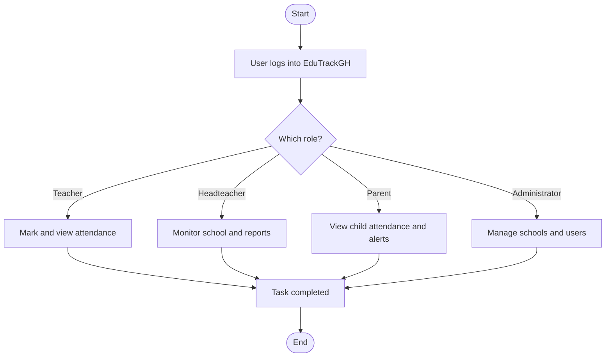
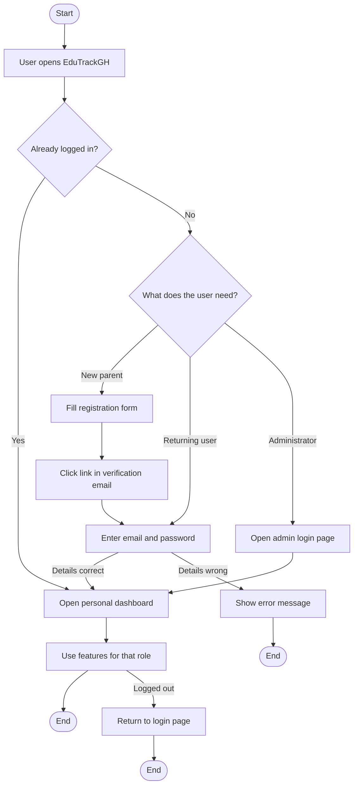
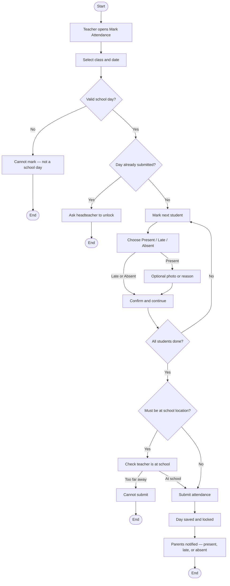
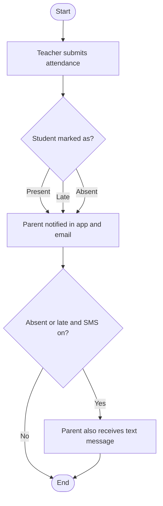
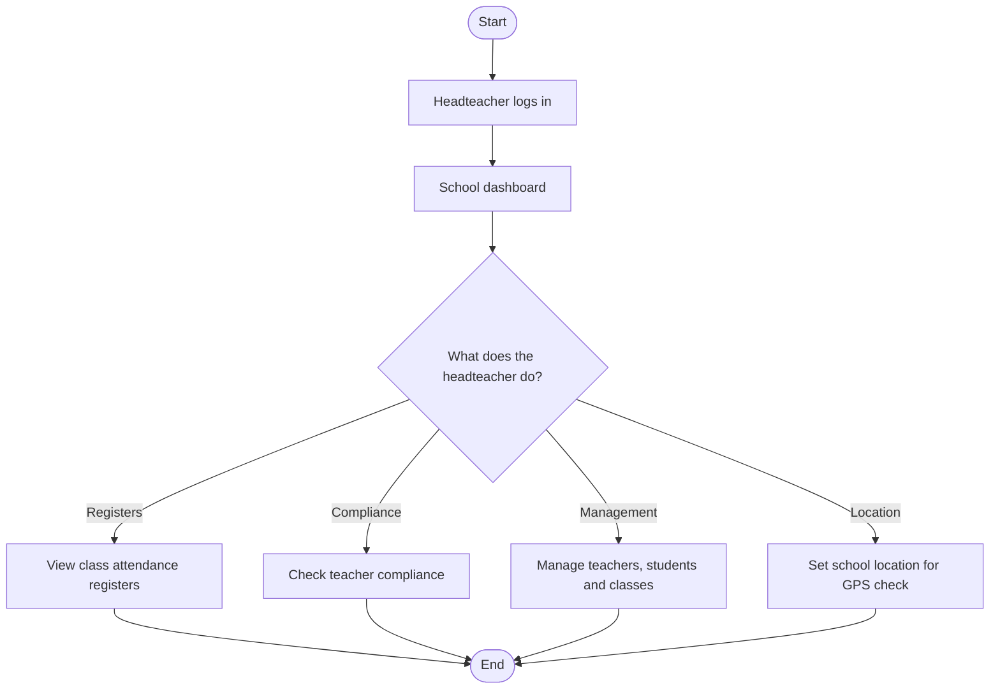
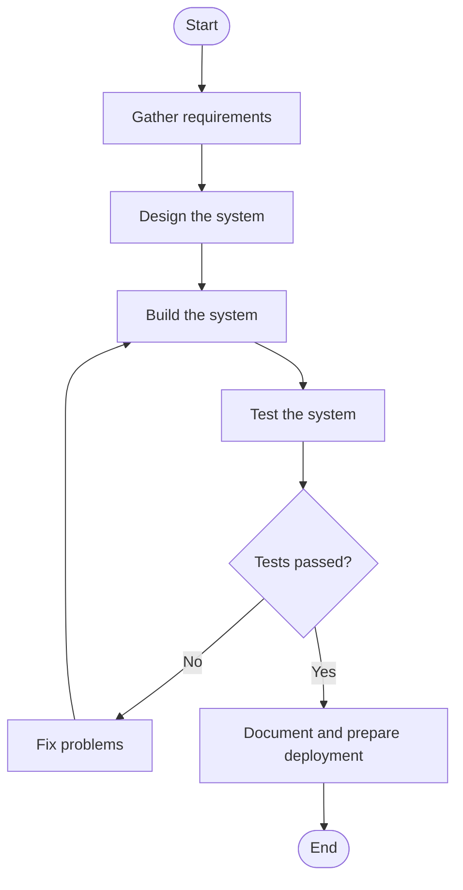
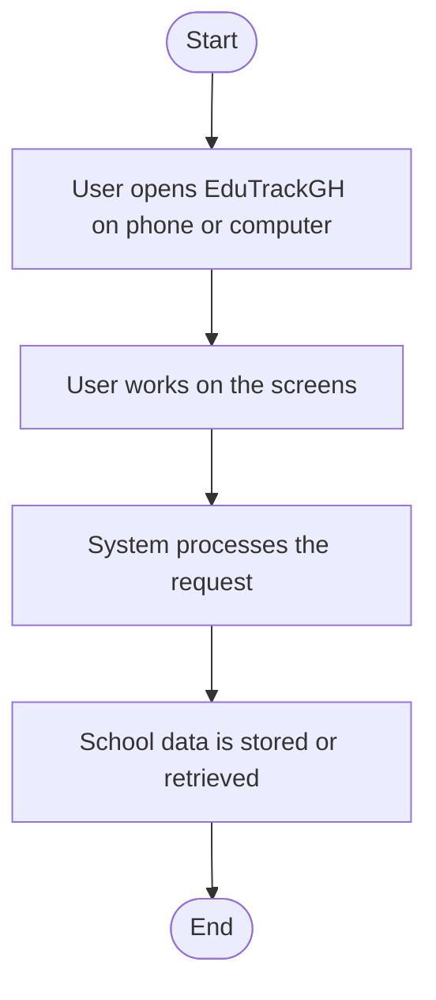

# EduTrackGH Project Report — Chapters 3, 4 & 5 (Draft)

**Student:** Okasha Abdallah (CSC/0030/22)  
**Project:** EduTrackGH: Smart Attendance & Absenteeism Monitoring System  
**Supervisor:** Dr Tandor Lewrence  
**Institution:** University for Development Studies — Department of Computer Science  
**Year:** 2026  

> **How to use this file:** Copy each section into your Word report. Apply UDS formatting (Times New Roman 12pt, 1.5 line spacing, chapter headings in UPPER CASE). Replace placeholder figure numbers (e.g. Figure 3.1) after you insert diagrams in Word. Mermaid blocks can be pasted into [mermaid.live](https://mermaid.live) to export PNG/SVG for your report.

---

## CHAPTER THREE: METHODOLOGY – SYSTEM

### 3.1 Introduction

This chapter describes the **system development methodology**, **design representations**, **architecture**, **technologies**, **justification for technology choices**, and **testing approach** used to build EduTrackGH. The methodology is aligned with the objectives stated in Chapter One: to design a digital attendance system, monitor absenteeism, provide reports for school management, improve parent communication, and improve record accuracy for Ghanaian basic schools.

The system was developed as a **full-stack web application** (React frontend, Node.js/Express backend, MongoDB database) after requirements were gathered through **interviews with a headteacher** at Nante Islamic Junior High School (as reported in Chapter Two). Design decisions such as click-based marking, optional photo verification, GPS geo-fencing, and GES calendar integration directly reflect those field findings.

---

### 3.2 System Development Model

The **Agile-inspired iterative model** was adopted for this project. Work was organised in short iterations, each delivering a testable increment of functionality.

| Phase | Focus | Outcomes |
|-------|--------|----------|
| **1. Requirements & planning** | Problem definition, literature review, headteacher interview | Problem statement, objectives, feature list |
| **2. Analysis & design** | Use cases, data models, architecture, UI wireframes | ERD concepts, API design, role-based screens |
| **3. Implementation (iterative)** | Backend APIs → frontend pages → integrations | Auth, attendance, reports, notifications, calendar |
| **4. Testing & refinement** | Functional testing, bug fixes, UX feedback | Stable builds, corrected calculations, optional verification |
| **5. Documentation & deployment prep** | User flows, environment setup, deployment guides | README, `.env.example`, health checks |

**Why Agile (and not strict Waterfall)?**  
Attendance rules changed after stakeholder feedback (e.g. photo verification made optional to save time on poor networks). Iterative delivery allowed the system to evolve without restarting the entire project.

**Roles in the development process:**

- **Developer (student):** Analysis, coding, testing, documentation  
- **Supervisor:** Guidance and review  
- **Stakeholder (headteacher):** Validation of practical requirements  

---

### 3.3 Flowchart Representation

The following flowcharts describe **what users do** in EduTrackGH (plain language, no program code). Each diagram uses an **oval for Start** and an **oval for End**, as required in standard flowchart notation. Export each Mermaid diagram as an image (Figure 3.1, 3.2, etc.) for your final PDF.

---

#### Figure 3.1 — Who uses EduTrackGH

**Description:** Teachers, headteachers, parents, and administrators each log into the same web application and use features suited to their role. The system stores school records and can send alerts to parents.

---

#### Figure 3.2 — User login flow

**Description:** A user opens EduTrackGH, registers or logs in, verifies email if new, and reaches the correct dashboard for their role. Administrators use a separate login page.

---

#### Figure 3.3 — Daily attendance marking flow (Teacher)

**Description:** The teacher selects class and date, marks each student as present, late, or absent, optionally adds a photo or reason, submits when finished, and parents are notified for each status (present, late, or absent).

---

#### Figure 3.4 — Parent notification flow

**Description:** After the teacher submits attendance, the parent receives an in-app alert and email for **present, late, or absent**. If the school has SMS enabled, a text message is also sent when the student is **absent or late** (not for present).

---

#### Figure 3.5 — Headteacher monitoring & reporting flow

**Description:** After logging in, the headteacher opens the school dashboard and can view attendance registers by term or month, check whether teachers are marking on time, manage staff and classes, and set the school location used for attendance verification.

---

#### Figure 3.6 — System development lifecycle (simplified)

**Description:** Summary of how the project moved from requirements to deployment-ready software.

---

### 3.4 System Architecture

EduTrackGH follows a **three-tier client–server architecture**.

#### 3.4.1 Logical architecture

| Tier | Responsibility | Implementation |
|------|----------------|----------------|
| **Presentation** | User interface, routing, form validation | React 19, Vite, Tailwind CSS, React Router |
| **Application** | Business logic, authentication, APIs | Node.js, Express.js, middleware, services |
| **Data** | Persistent storage | MongoDB Atlas (Mongoose ODM) |

#### 3.4.2 Physical / deployment architecture

- **Frontend:** Static site (e.g. Render Static Site or similar) serving the built React app  
- **Backend:** Web service (e.g. Render) running `server.js` with environment variables  
- **Database:** MongoDB Atlas (cloud)  
- **Optional:** Cloudinary for attendance/profile images; Brevo for email; Hubtel for SMS  

#### 3.4.3 Component diagram (narrative)

**Frontend modules:** `pages/` (role dashboards), `components/`, `services/` (Axios API clients), `context/` (Auth, Theme, Calendar, Toast), `hooks/` (e.g. `useMarkAttendance`), `utils/` (GES calendar engine, geo-fence helpers).

**Backend modules:** `routes/` → `controllers/` → `services/` → `models/`. Cross-cutting: `middleware/authMiddleware.js`, `roleMiddleware`, validators, rate limiting, error handler.

**Core data entities:** User, School, Classroom, Student, DailyAttendance, Notification, Calendar (GES), ChatMessage, AttendanceFlag, AuthAuditLog.

#### Figure 3.7 — How the system is organised (simple view)

**Description:** Users interact with screens in the web browser. The server processes their actions. School data is kept in a database.

---

### 3.5 Technologies and Tools Used

#### Table 3.1 — Technologies and tools

| Category | Technology / Tool | Version (approx.) | Purpose |
|----------|-------------------|-------------------|---------|
| **Language** | JavaScript (ES6+) | — | Full-stack development |
| **Frontend framework** | React | 19.x | UI components |
| **Build tool** | Vite | 7.x | Fast dev server & production build |
| **Styling** | Tailwind CSS | 3.x | Responsive UI |
| **Routing** | React Router | 7.x | SPA navigation |
| **HTTP client** | Axios | — | API communication |
| **Realtime** | Socket.IO client | 4.x | Chat / live updates |
| **Backend runtime** | Node.js | 18+ | Server execution |
| **Backend framework** | Express.js | 4.x | REST API |
| **ODM** | Mongoose | 8.x | MongoDB schemas & queries |
| **Database** | MongoDB | Atlas | Data persistence |
| **Authentication** | JSON Web Token (JWT) | — | Stateless sessions |
| **Password hashing** | bcryptjs | — | Secure password storage |
| **Email** | Brevo API | — | Verification & password reset |
| **SMS (optional)** | Hubtel API | — | Parent SMS alerts (Ghana) |
| **Images** | Cloudinary (+ local fallback) | — | Attendance/profile photos |
| **Version control** | Git / GitHub | — | Source control |
| **IDE** | Visual Studio Code / Cursor | — | Development |
| **API testing** | Browser, Postman (optional) | — | Endpoint verification |
| **Deployment** | Render (documented) | — | Hosting frontend & backend |

---

### 3.6 Choice of Technologies

#### 3.6.1 React and Vite (frontend)

React was chosen because it supports **component-based UI**, which fits role-specific dashboards (teacher, headteacher, parent, admin). Vite provides **fast development** and optimised production builds. Together they support **mobile-friendly** interfaces, which matches the headteacher’s preference for smartphone use in schools without computers.

#### 3.6.2 Node.js and Express (backend)

JavaScript on the server allows **one language** across the stack, reducing complexity for a single-developer project. Express is lightweight, widely documented, and suitable for REST APIs that serve the React client.

#### 3.6.3 MongoDB and Mongoose

Attendance data is naturally **document-oriented** (daily records per student, nested classroom relationships). MongoDB scales to cloud hosting (Atlas) and supports flexible schema evolution during iterative development (e.g. optional verification fields, geo-location metadata).

#### 3.6.4 JWT authentication

JWT enables **stateless authentication** between SPA and API, which simplifies deployment on platforms like Render. Role claims in the token support **role-based access control** (teacher vs headteacher vs parent vs admin).

#### 3.6.5 Brevo (email)

Transactional email for **registration verification** and **password reset** is more reliable than self-hosted SMTP for a student project deployed to the cloud.

#### 3.6.6 GPS (browser Geolocation API + Haversine)

Instead of expensive biometric hardware, **geo-fencing** uses the teacher’s phone GPS to confirm marking occurs near the school coordinates set by the headteacher—addressing attendance integrity concerns raised in the interview.

#### 3.6.7 GES calendar engine

A dedicated calendar module aligns attendance with **Ghana Education Service** school days (terms, holidays, vacation, BECE days), preventing marks on invalid dates and supporting accurate registers.

#### 3.6.8 Technologies not used (and why)

| Alternative | Reason for not adopting |
|-------------|-------------------------|
| Biometric / RFID hardware | Cost and maintenance unsuitable for many basic schools |
| Strict facial recognition | Headteacher feedback: wastes lesson time; teachers already know pupils |
| Native mobile app only | Web app works on phones and future PCs; faster to deploy |
| SQL database | MongoDB sufficient for document-style attendance records |

---

### 3.7 System Testing

Testing was conducted throughout development using **manual functional testing** and **scenario-based validation**. Automated unit test suites were not the primary focus due to project time constraints; future work can add Jest/Cypress.

#### 3.7.1 Testing objectives

- Verify each user role can only access permitted functions  
- Confirm attendance is saved correctly and locked after submission  
- Confirm parent notifications trigger for present, late, and absent  
- Validate GPS fence behaviour when school location is configured  
- Validate GES calendar blocks invalid dates  
- Verify attendance history percentages match register data  

#### 3.7.2 Types of testing performed

| Test type | Description | Examples |
|-----------|-------------|----------|
| **Unit-level (informal)** | Individual functions (e.g. rate calculation, geo distance) | `attendanceRegisterStats.js`, `haversineMeters` |
| **Integration testing** | Frontend + backend + database | Mark attendance end-to-end |
| **Functional testing** | Features vs requirements | Login, mark attendance, view history |
| **Security testing** | Auth and authorisation | Access admin routes without admin token |
| **Usability testing** | Ease of marking | One-student-at-a-time flow; optional photo |
| **Compatibility** | Browsers / mobile | Chrome, mobile viewport |

#### Table 3.2 — Requirements traceability (objectives → features → tests)

| Specific objective (Ch. 1) | System feature | Test method | Expected result |
|----------------------------|----------------|-------------|-----------------|
| 1. Digital attendance recording | Teacher Mark Attendance + `POST /api/attendance/daily` | Mark full class for valid school day | Records in DB; success message |
| 2. Absenteeism monitoring | Flagged students, history register, analytics | View flagged list & term register | Absent patterns visible |
| 3. Real-time reports | Headteacher dashboard, class registers | Open reports for selected month/term | Correct P/A/L totals |
| 4. Parent communication | Notifications + optional SMS | Mark student present, late, or absent | Parent sees notification |
| 5. Accuracy & reliability | Locking, geo-fence, GES calendar | Submit outside fence / wrong date | Request rejected with message |

#### Table 3.3 — Sample test cases (attendance module)

| ID | Test case | Steps | Expected result |
|----|-----------|-------|-----------------|
| TC-01 | Teacher login | Valid teacher credentials | Redirect to teacher dashboard |
| TC-02 | Mark present without photo | Select Present → Confirm without verification | Saves successfully |
| TC-03 | Mark with GPS fence | Submit outside school radius | Error: outside allowed area |
| TC-04 | Invalid school day | Select weekend date | Cannot mark; warning shown |
| TC-05 | Parent notification | Mark student present, late, or absent | Parent notification created |
| TC-06 | Attendance history rate | Open term register | Row % matches P/A/L columns |
| TC-07 | Locked date | Re-mark locked date | Blocked; unlock message shown |
| TC-08 | Headteacher register | View class register for Term 1 | Grid matches stored marks |

#### 3.7.3 Test environment

- **OS:** Windows 10/11  
- **Browser:** Google Chrome (primary)  
- **Backend:** `http://localhost:5000` (development)  
- **Frontend:** `http://localhost:5173` (Vite dev server)  
- **Database:** MongoDB Atlas or local MongoDB  
- **Test users:** Created via `npm run create-test-users` script  

#### 3.7.4 Limitations of testing

- Full-scale deployment in multiple real schools was not completed within the project timeline  
- SMS testing depends on Hubtel credentials and mobile network  
- GPS accuracy varies by device and building interference  
- Load/stress testing for hundreds of concurrent users was not performed  

---

### 3.8 Chapter Summary

This chapter presented the **Agile-inspired methodology**, **flowcharts** for authentication, attendance marking, notifications, and reporting, and the **three-tier architecture** of EduTrackGH. It documented the **technologies** used (React, Node.js, Express, MongoDB, JWT, Brevo, optional Hubtel SMS, Cloudinary) and **justified** each choice in the Ghanaian basic school context. **Testing** was described through functional and scenario-based cases mapped to the project objectives. Chapter Four presents the implemented system and discusses results against those objectives.

---

## CHAPTER FOUR: RESULTS AND DISCUSSIONS

### 4.1 Introduction

This chapter presents the **implemented EduTrackGH system**, describes its main modules and user interfaces, and discusses how the results address the **problem statement**, **research questions**, and **objectives** from Chapter One. The discussion links implementation outcomes to findings from the literature review and headteacher interview in Chapter Two.

---

### 4.2 System Description

EduTrackGH is a **web-based Smart Attendance and Absenteeism Monitoring System** for Ghanaian basic schools (Primary and Junior High). It replaces paper registers with a digital workflow while remaining usable on **low-cost smartphones**.

#### 4.2.1 User roles and access

| Role | Primary users | Main capabilities |
|------|---------------|-------------------|
| **Teacher** | Class teachers | Mark daily attendance; view history & flagged students; manage class students (with approval rules); chat |
| **Headteacher** | School leader | School dashboard; class registers; compliance; manage teachers/students/classes; set school GPS location; unlock attendance |
| **Parent** | Guardians | Register & verify email; link children; view attendance & notifications |
| **Administrator** | System admin | Manage schools, users, GES calendar, analytics, audit logs |

Students **do not log in**; they exist as records linked to classrooms and parents.

#### 4.2.2 Major functional modules

**1. Authentication and security**

- Registration (default role: parent) with **email verification**  
- Login with JWT; separate **admin login URL** (not exposed on public login page)  
- Password reset via secure token (Brevo email)  
- Role-based route protection on frontend and `authorize()` middleware on backend  
- Rate limiting on failed logins; auth audit logging  

**2. School and classroom management**

- Schools with level (Primary / JHS / Both)  
- Classrooms assigned to teachers  
- Student records with parent contact details  
- Headteacher can configure **school GPS location and radius** for geo-fencing  

**3. Daily attendance (core module)**

- Teacher selects **class** and **date**  
- **GES calendar** prevents marking on weekends, holidays, vacation, or BECE days (where applicable)  
- One-student-at-a-time marking: **Present**, **Late**, **Absent**  
- **Optional** photo capture or manual reason for present (based on headteacher feedback on network/lighting)  
- Optional **GPS verification** when school location is configured  
- Attendance **locked** after submission; headteacher can approve **unlock requests**  
- **Integrity flags** (e.g. consecutive 100% present, rapid marking patterns)  

**4. Attendance history and registers**

- **Term** and **month** views with GES-aligned week columns  
- Per-student and overall **attendance rates** calculated from actual marks on school days shown in the grid  
- Export to **CSV** and **Excel**  

**5. Absenteeism monitoring**

- **Flagged students** view for suspicious patterns  
- Headteacher can identify frequent absenteeism through registers and dashboards  

**6. Parent engagement**

- In-app **notifications** and email when child is marked **present, late, or absent**  
- Optional **SMS** via Hubtel when enabled (absent and late only)  
- Parent dashboard for linked children’s attendance  

**7. Reporting and administration**

- Headteacher **school reports** and compliance views  
- System admin: schools, users, **GES calendar management**, analytics  

**8. Communication**

- **Chat** between teachers and headteachers (Socket.IO)  

#### 4.2.3 Screens and workflows (narrative for your report)

When writing in Word, you may add **screenshots** with captions:

- **Figure 4.1** — Teacher dashboard (suggested screenshot)  
- **Figure 4.2** — Mark Attendance screen with Present/Late/Absent and optional verification  
- **Figure 4.3** — Attendance History / class register (term view)  
- **Figure 4.4** — Parent notifications list  
- **Figure 4.5** — Headteacher dashboard and school location settings  
- **Figure 4.6** — Administrator school management page  

**Teacher workflow (result):** A teacher opens Mark Attendance, selects class and date, marks each pupil in under a minute per student without mandatory photography, submits once all are done, and the system locks the day.

**Headteacher workflow (result):** The headteacher opens Class Registers, selects term or month, reviews colour-coded cells (present/late/absent), and exports data for meetings or GES reporting.

**Parent workflow (result):** After linking a child, the parent receives timely alerts when the child is marked present, late, or absent, instead of discovering truancy weeks later (supporting the real case cited in Chapter Two).

#### 4.2.4 Database design (summary)

Key collections include:

- **Users** — credentials, role, school links, parent `children` array  
- **Schools** — name, level, `location` (lat/lng/radius)  
- **Classrooms** — grade, teacher, school  
- **Students** — classroom, parent phone, approval status  
- **DailyAttendance** — unique (classroom, date, student), status, optional photo/verification, lock flag  
- **Notifications** — parent alerts  
- **Calendar** — GES terms, holidays, resumption dates  

#### 4.2.5 API overview (summary table)

| Module | Example endpoints |
|--------|-------------------|
| Auth | `POST /api/auth/register`, `login`, `verify-email`, `forgot-password` |
| Attendance | `POST /api/attendance/daily`, `GET .../history`, `upload-photo` |
| Classrooms | `GET /api/classrooms`, `GET .../students` |
| Parent | `GET /api/parent/...` attendance overview |
| Headteacher | `GET /api/headteacher/...` |
| Admin | `GET/POST /api/admin/schools`, calendar CRUD |
| Health | `GET /api/health` |

#### 4.2.6 Discussion — alignment with research questions

| Research question (Ch. 1) | How EduTrackGH addresses it |
|---------------------------|-----------------------------|
| RQ1: Digital improvement of attendance recording | Replaces paper with structured digital marks and locked daily records |
| RQ2: Effective absenteeism monitoring | Registers, flags, and history analytics highlight patterns |
| RQ3: Real-time reporting for management | Headteacher dashboards and exportable registers |
| RQ4: School–parent communication | Notifications for present, late, and absent; optional SMS for absent/late |
| RQ5: Accuracy vs manual methods | Validation rules, geo-fence, GES days, consistent rate calculations |

#### 4.2.7 Discussion — strengths and weaknesses observed during testing

**Strengths**

- Fast click-based marking suitable for basic schools  
- Works on mobile browsers  
- Multi-role support in one platform  
- GES-aware calendar reduces invalid marks  
- Optional verification balances integrity with practical field conditions  

**Weaknesses / constraints**

- Requires internet at time of marking (offline mode not implemented)  
- GPS accuracy may vary indoors  
- SMS costs depend on third-party service configuration  
- Full nationwide pilot was outside project scope  

#### Table 4.1 — Objectives achievement summary

| Objective | Status | Evidence |
|-----------|--------|----------|
| General: Smart attendance & absenteeism system | Achieved | Deployable full-stack application |
| Specific 1: Digital recording | Achieved | Mark Attendance module |
| Specific 2: Absenteeism tracking | Achieved | Flags + registers |
| Specific 3: Real-time reports | Achieved | Headteacher dashboards & exports |
| Specific 4: Parent communication | Achieved | Notifications (+ optional SMS) |
| Specific 5: Accuracy & reliability | Partially achieved | Locks, geo-fence, calendar; needs wider school pilot for full validation |

---

### 4.3 Chapter Summary

Chapter Four described the **delivered EduTrackGH system**, its roles, modules, and workflows. The implementation satisfies the project’s main functional requirements and responds to stakeholder needs identified in Chapter Two. The system demonstrates that a **practical, mobile-friendly, GPS-aware attendance platform** can support Ghanaian basic schools without expensive biometric infrastructure. Chapter Five concludes the project and provides recommendations for future work and deployment.

---

## CHAPTER FIVE: CONCLUSION AND RECOMMENDATION

### 5.1 Introduction

This final chapter summarises the **outcomes** of the EduTrackGH project, states **conclusions** in relation to the problem statement and objectives, and offers **recommendations** for deployment, future research, and system improvement.

---

### 5.2 Conclusion

Manual attendance registers remain common in many Ghanaian basic schools, yet they are prone to **errors, delays, lost records, and weak absenteeism follow-up**, as discussed in Chapters One and Two. Frequent absenteeism harms learning outcomes, and delayed communication with parents can allow truancy to continue undetected.

This project successfully **designed and implemented EduTrackGH**, a Smart Attendance and Absenteeism Monitoring System tailored to the Ghanaian basic school context. The system provides:

1. **Efficient digital attendance marking** for teachers using simple status buttons and optional verification.  
2. **Absenteeism monitoring** through attendance history, registers, and integrity flags.  
3. **Management information** for headteachers via dashboards and exportable reports.  
4. **Parent engagement** through automated notifications when students are marked present, late, or absent.  
5. **Improved data quality** through date locking, GES calendar rules, optional geo-fencing, and consistent statistical calculations.

The development process followed an **iterative methodology**, allowing the system to incorporate real feedback—such as making photo verification optional when network and lighting conditions would slow marking.

In conclusion, EduTrackGH demonstrates that a **low-cost, software-based solution** can address major limitations of paper-based attendance systems and support school efforts to improve discipline, accountability, and parent involvement. The project meets its **general objective** and largely fulfils its **specific objectives**, within the stated scope (software-only, no biometric hardware, pilot limited by time and resources).

---

### 5.3 Recommendations

#### 5.3.1 Recommendations for schools and education authorities

1. **Pilot deployment** — Introduce EduTrackGH in one or two partner schools (e.g. Nante Islamic JHS) for one academic term before wider rollout.  
2. **Teacher training** — Conduct short workshops on marking attendance, handling unlock requests, and using registers for absentee follow-up.  
3. **Parent onboarding** — Encourage parents to register and link children at the start of the term to maximise notification benefits.  
4. **School location setup** — Headteachers should configure GPS centre and radius carefully on site to balance security and usability.  
5. **Internet strategy** — Schools with weak connectivity should mark attendance during periods of stable mobile data or plan for future offline-sync enhancement.

#### 5.3.2 Recommendations for technical improvement

1. **Offline-first mode** — Cache attendance locally and sync when connectivity returns (critical for rural schools).  
2. **Automated testing** — Add unit and end-to-end tests (Jest, Cypress) for attendance and auth flows.  
3. **USSD or SMS fallback** — Allow absence alerts even when parents lack smartphones.  
4. **National integration** — Explore alignment with GES EMIS or district reporting formats.  
5. **Analytics dashboard** — Expand predictive analytics for at-risk absentees across terms.  
6. **Multilingual UI** — Support local languages for parent-facing screens.  
7. **Performance testing** — Load-test APIs before district-wide deployment.

#### 5.3.3 Recommendations for future research

1. Conduct a **quantitative study** comparing absenteeism rates before and after system adoption.  
2. Survey **teachers and parents** on usability and trust after a full term of use.  
3. Investigate **cost–benefit analysis** of SMS notifications versus in-app-only alerts.  
4. Research **privacy and data protection** compliance (Ghana Data Protection Act) for student attendance data stored in the cloud.

---

## APPENDIX GUIDANCE (for your report)

| Appendix item | Suggested content |
|---------------|-------------------|
| **Appendix A** | Sample questionnaire / interview guide (headteacher) |
| **Appendix B** | Selected source code listings (e.g. `attendanceService.js`, `MarkAttendance.jsx`) |
| **Appendix C** | User manual (login steps per role) |
| **Appendix D** | `.env.example` redacted configuration |
| **Appendix E** | Test case log (screenshots of pass/fail) |

---

## LIST OF FIGURES (suggested — update page numbers in Word)

| Figure | Title |
|--------|--------|
| Figure 3.1 | High-level system context diagram |
| Figure 3.2 | User authentication flowchart |
| Figure 3.3 | Daily attendance marking flowchart |
| Figure 3.4 | Parent notification flowchart |
| Figure 3.5 | Headteacher monitoring flowchart |
| Figure 3.6 | System development lifecycle |
| Figure 3.7 | Three-tier system architecture |
| Figure 4.1 | Teacher dashboard (screenshot) |
| Figure 4.2 | Mark Attendance interface (screenshot) |
| Figure 4.3 | Attendance History register (screenshot) |
| Figure 4.4 | Parent notifications (screenshot) |
| Figure 4.5 | Headteacher dashboard (screenshot) |

---

## LIST OF TABLES (suggested)

| Table | Title |
|-------|--------|
| Table 3.1 | Technologies and tools used |
| Table 3.2 | Requirements traceability matrix |
| Table 3.3 | Sample test cases for attendance module |
| Table 4.1 | Objectives achievement summary |

---

## REFERENCES TO ADD (examples — align with your Chapter 2 APA list)

- Obeng-Denteh, W., et al. (2011). *[Complete citation as in your Chapter 2]*  
- Philip Baiden, et al. *[Complete citation as in your Chapter 2]*  
- Ghana Education Service. *[Any GES calendar / policy documents you cited]*  
- MongoDB Inc. (n.d.). *MongoDB documentation*. https://www.mongodb.com/docs  
- Meta Open Source. (n.d.). *React documentation*. https://react.dev  
- Express.js. (n.d.). *Express web framework*. https://expressjs.com  

---

*End of draft — Chapters 3, 4, and 5 for EduTrackGH project report.*
