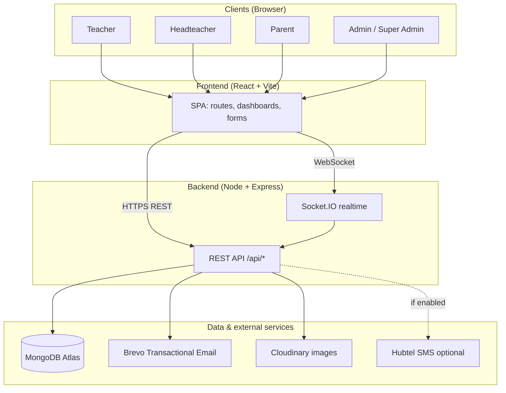
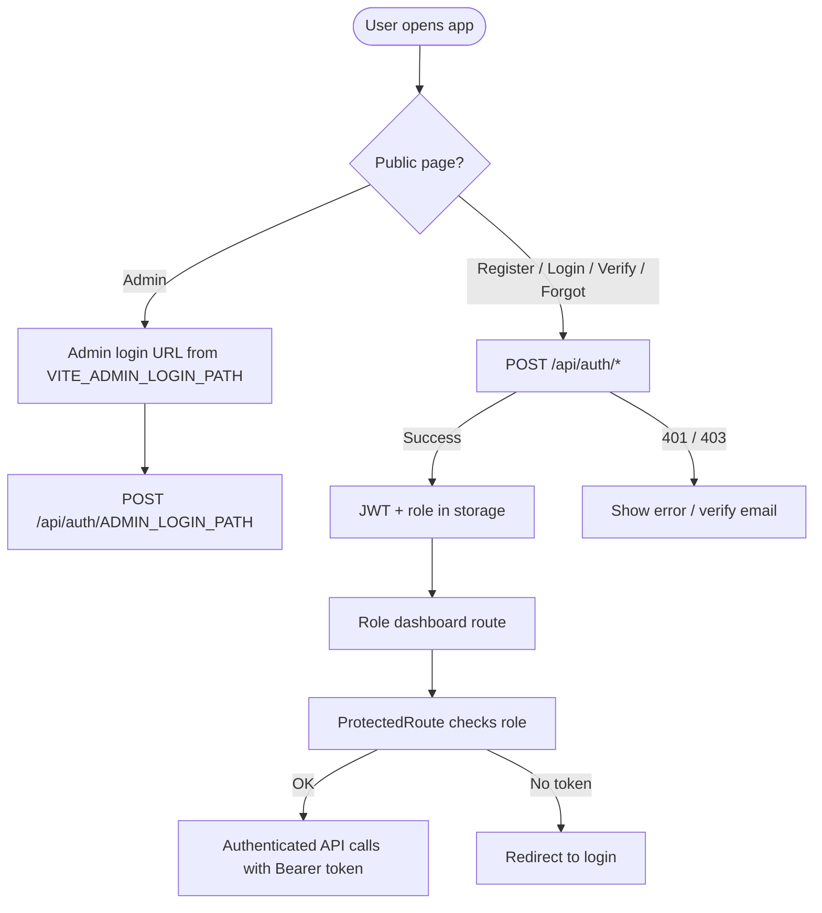
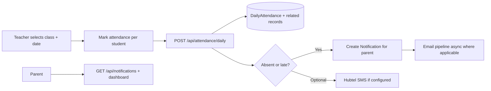
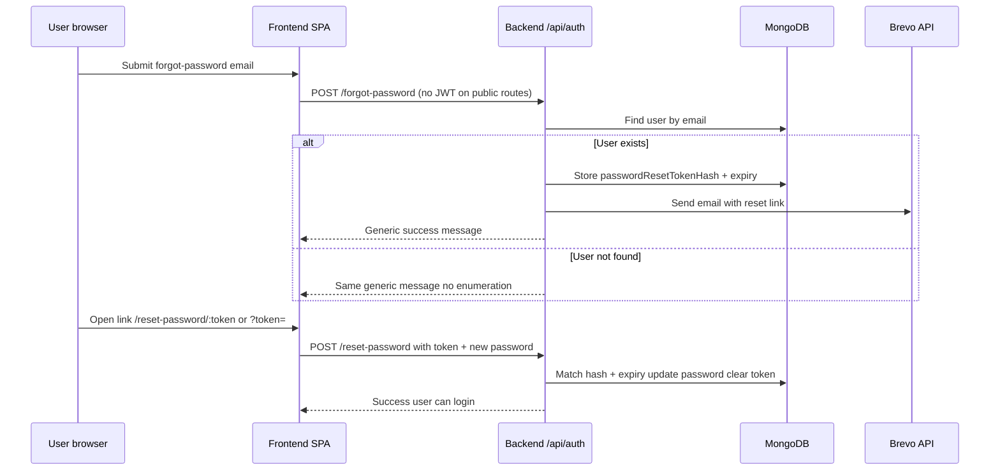

# EduTrack GH — Project Report Document

**Generated for:** Project documentation and academic / technical report writing  
**Repository:** EduTrackGH (monorepo: `eduTrackGH-backend` + `eduTrackGH-frontend`)  
**Product:** Intelligent absenteeism monitoring and attendance integrity for Ghanaian **Primary** and **JHS** schools  

---

## Table of contents

1. [Executive summary](#1-executive-summary)  
2. [Project flowcharts](#2-project-flowcharts)  
3. [Project structure](#3-project-structure)  
4. [Work completed: beginning to current state](#4-work-completed-beginning-to-current-state)  
5. [Technology stack](#5-technology-stack)  
6. [Environment and deployment notes](#6-environment-and-deployment-notes)  
7. [References within the repo](#7-references-within-the-repo)  

---

## 1. Executive summary

**EduTrack GH** is a full-stack web application that lets **teachers** record daily class attendance, **headteachers** monitor school-wide compliance and reports, **parents** view their children’s attendance and receive notifications (with optional SMS), and **system administrators** manage schools, users, and system configuration including a **GES-aware academic calendar**. Students do not log in; they are data records linked to classrooms and parents.

The system emphasizes **attendance integrity** (e.g. evidence-backed “present” marking, validation rules, audit-oriented features) and **security** (JWT, bcrypt, isolated admin login path, CORS allowlists, rate limiting on failed logins, `trust proxy` for correct IPs behind load balancers).

---

## 2. Project flowcharts

The diagrams below use [Mermaid](https://mermaid.js.org/) syntax. They render in GitHub, many IDEs, and documentation tools.

### 2.1 High-level system context



### 2.2 Authentication and session flow (simplified)



### 2.3 Core attendance → parent notification flow (conceptual)



### 2.4 Password reset flow (current design)



---

## 3. Project structure

### 3.1 Repository root

```
EduTrackGH/
├── README.md                      # Root readme (some sections may predate Brevo; see backend README)
├── PROJECT_DOCUMENT.md            # Detailed feature inventory (living document)
├── PROJECT-CONTEXT.md             # Design intent: integrity, roles, PWA context
├── PARENT_LINKING_EXPLANATION.md  # Parent–student linking notes
├── SECURITY-HARDENING-IMPLEMENTATION.md
├── report.md                      # This file
├── eduTrackGH-backend/            # Node.js API
└── eduTrackGH-frontend/           # React (Vite) SPA
```

### 3.2 Backend (`eduTrackGH-backend/`)

```
eduTrackGH-backend/
├── server.js                 # Express app, CORS, routes, health, HTTP + Socket.IO
├── package.json
├── .env.example
├── config/
│   └── db.js                 # MongoDB connection
├── models/                   # Mongoose schemas
│   ├── User.js
│   ├── School.js
│   ├── Classroom.js
│   ├── Student.js
│   ├── DailyAttendance.js
│   ├── Notification.js
│   ├── Calendar.js
│   ├── ChatMessage.js
│   ├── TeacherMessage.js
│   ├── AttendanceFlag.js
│   ├── AuthAuditLog.js
│   ├── Parent.js
│   └── AdminConfig.js
├── controllers/              # Route handlers (business logic entry points)
├── routes/                   # Express routers mounted under /api/*
├── middleware/               # authMiddleware, roleMiddleware, rate limits, validation, errors
├── services/                 # emailService (Brevo), attendance, calendar runtime, student helpers, etc.
├── utils/                    # JWT, socket server, CORS origins, validators, SMS, Cloudinary
└── scripts/                  # e.g. createTestUsers.js
```

**Mounted API prefixes** (from `server.js`):

| Prefix | Purpose |
|--------|---------|
| `/api/auth` | Register, login, admin login, verify email, forgot/reset password, me, logout, profile photo |
| `/api/attendance` | Daily attendance marking and history |
| `/api/classrooms` | Teacher classrooms and students |
| `/api/students` | Student CRUD, updates, pending edit approvals |
| `/api/headteacher` | Headteacher school operations |
| `/api/admin` | Super-admin / admin operations |
| `/api/notifications` | Parent notifications |
| `/api/reports` | School reports |
| `/api/messages` | Teacher–headteacher messaging |
| `/api/chat` | Chat |
| `/api/calendar` | GES calendar CRUD / queries |
| `/api/parent` | Parent attendance overview and records |

### 3.3 Frontend (`eduTrackGH-frontend/`)

```
eduTrackGH-frontend/
├── vite.config.js            # Dev server + proxy to backend (/api, socket.io)
├── package.json
├── .env.example
└── src/
    ├── main.jsx
    ├── App.jsx               # Router: public + role dashboards + admin routes
    ├── index.css
    ├── components/           # Reusable UI (FormInput, ProtectedRoute, layouts, etc.)
    ├── context/              # Auth, Theme, Toast, Calendar, Socket, Confirm, …
    ├── pages/
    │   ├── public/           # Landing, Login, Register, VerifyEmail, ForgotPassword, ResetPassword
    │   ├── teacher/          # Dashboard, MarkAttendance, History, Flagged, ManageStudents, Chat
    │   ├── headteacher/      # Dashboard, Reports, Compliance, Classes, Teachers, Students, Chat
    │   ├── parent/           # Dashboard, ChildrenAttendance, Notifications
    │   └── admin/            # AdminLogin, Dashboard, Schools, Headteachers, Users, Students, …
    ├── services/             # authService, api.js (Axios), attendance, admin, notifications, …
    ├── utils/                # constants, validators, envApi, login helpers
    └── layouts/              # Dashboard / public layouts
```

---

## 4. Work completed: beginning to current state

This section is organized as a **chronological / thematic evolution** of the system. Items are grounded in the codebase and in-repo docs (`PROJECT_DOCUMENT.md`, `PROJECT-CONTEXT.md`, `SECURITY-HARDENING-IMPLEMENTATION.md`, `PARENT_LINKING_EXPLANATION.md`).

### Phase A — Foundation and architecture

- **Monorepo** split: dedicated backend and frontend packages.
- **Backend:** Express server with JSON body parsing (large limit for base64 images), global error middleware, 404 handler, `GET /api/health` (includes `emailConfigured` flag).
- **Database:** MongoDB via Mongoose; connection module under `config/db.js`.
- **Configuration:** `dotenv` loaded at startup; `.env.example` documents required variables.
- **CORS:** Centralized allowed origins (`utils/corsOrigins.js`) from `FRONTEND_URL` (comma-separated), with dev defaults for localhost / 127.0.0.1; production may include known deployment aliases as documented in code comments.
- **Reverse proxy:** `trust proxy` enabled for correct client IP (e.g. Render).

### Phase B — Authentication, authorization, and users

- **User model:** Roles `teacher`, `headteacher`, `parent`, `admin`, `super_admin`; bcrypt-hashed passwords; email verification fields; account status; school/classroom links; parent `children` references; optional profile photo fields.
- **JWT:** Issued on successful login; validated in `protect` middleware.
- **Role-based access:** `authorize` patterns on admin and role-specific routes.
- **Public registration:** Defaults to **parent** role; email verification workflow.
- **Resend verification** with rollback on email delivery failure (per `PROJECT_DOCUMENT.md` narrative).
- **Password reset:** `POST /api/auth/forgot-password`, `POST /api/auth/reset-password` — secure random token, SHA-256 hash stored, expiry (~30 minutes), single-use invalidation; Brevo sends reset email; reset links built to match environment (request origin when trusted, otherwise configured frontend base; development fallback avoids pointing local tokens at production SPA).
- **Reset UX (frontend):** `/forgot-password`, `/reset-password` and `/reset-password/:token`; axios does not attach JWT to public auth/recovery calls; recovery pages avoid destructive redirects on 401 from stale sessions.
- **Admin isolation:** Admin login uses **separate** URL path on frontend and matching `POST /api/auth/:ADMIN_LOGIN_PATH` on backend; public `/login` rejects admin users (must use admin portal).
- **Rate limiting:** Failed login attempt tracking (`middleware/rateLimitMiddleware.js`).
- **Auth audit log:** `AuthAuditLog` model for events such as login, failed login, logout, password reset (where written).

### Phase C — Schools, classrooms, students

- **School** entity: levels (PRIMARY / JHS / BOTH), headteacher linkage, active flags.
- **Classroom** entity: grade, school, assigned teacher, student counts.
- **Student** entity: not a login user; links to school/classroom; parent contact fields; attendance-related flags/stats.
- **APIs:** Classroom listing, detail, students for teacher workflows (`/api/classrooms`).
- **Student updates:** Teacher vs headteacher rules; **pending edit** queue for teacher-proposed changes on approved students until headteacher approves (`student.update.controller.js`, `studentService.js`, pending-edit controllers/routes).

### Phase D — Daily attendance (core product)

- **DailyAttendance** model: unique constraint on classroom + date + student; status present/late/absent; marked-by teacher; verification metadata (photo/manual) as implemented in controllers and validators.
- **Teacher APIs:** Submit daily attendance; retrieve classroom daily history (`/api/attendance`).
- **Integrity posture (design intent in `PROJECT-CONTEXT.md`):** Reduce bulk marking and false “present” via structured flows, photo evidence to Cloudinary where required, manual fallback with reason, metadata (timestamps, optional geo), locking/immutability concepts and admin audit views as implemented in respective modules.

### Phase E — Parent notifications and monitoring

- **Notification** model and APIs: list, mark read, read-all; unread counts (per `PROJECT_DOCUMENT.md` §11.4).
- **Parent routes:** Attendance overview and monthly records (`/api/parent/...`) for real dashboard data.
- **Email notifications:** Async / non-blocking patterns for parent emails where designed not to block attendance saves.
- **Sound alerts (frontend):** Optional Web Audio alert when unread count increases (subject to browser autoplay policy).
- **Parent–student linking:** Email-authoritative reconciliation to avoid wrong child linkage (`PROJECT_DOCUMENT.md` §11.6, `PARENT_LINKING_EXPLANATION.md`).

### Phase F — Headteacher reporting and compliance

- **School reports** by month (`/api/reports/school`).
- **Teacher compliance** UI and supporting backend usage.
- **Headteacher routes** for managing classes, teachers, students, and operational views.

### Phase G — Admin / super-admin control plane

- **School CRUD**, headteacher/teacher provisioning, system settings.
- **GES calendar management** UI (`GesCalendarManagement.jsx`) backed by `/api/calendar`.
- **Operational pages:** Audit logs, auth logs, GPS audit, analytics, alerts, notification control, “view as” tooling (routes present under `pages/admin/`).

### Phase H — GES calendar engine (database + runtime)

- **Admin-managed calendar** data in MongoDB.
- **Runtime engine** with caching/TTL and invalidation (`services/calendarRuntime.js`); shared decisions for school-day vs non-school-day across attendance and compliance.
- **Frontend** calendar context and utilities aligned with backend decisions.

### Phase I — Communications and realtime

- **Socket.IO** server attached to HTTP server; client provider in frontend.
- **Chat** and **teacher messaging** routes/models (`/api/chat`, `/api/messages`, `ChatMessage`, `TeacherMessage`).

### Phase J — Email infrastructure (Brevo)

- **Transactional email via Brevo API** (`sib-api-v3-sdk`), not app-level SMTP from Node.
- **Environment:** `BREVO_API_KEY` (transactional key `xkeysib-...`), `BREVO_FROM_EMAIL` verified sender.
- Used for verification, password reset, and transactional parent/school emails as wired in services and controllers.

### Phase K — Security hardening (documented + implemented themes)

- Documented in `SECURITY-HARDENING-IMPLEMENTATION.md`: rationale for admin endpoint isolation, phased roadmap (2FA, stronger session policy, etc.).
- Implemented themes: hidden admin path, differentiated rate limits, audit logging foundations, CORS tightening, JWT hygiene on public routes.

### Phase L — Frontend UX and polish (non-exhaustive)

- **Theming:** Dark/light mode.
- **Dashboard layouts** and role-specific navigation.
- **Tailwind**-based consistent UI; lazy-loaded heavy dashboard chunks in `App.jsx`.
- **Environment-aware API base:** `src/utils/envApi.js` — dev proxy to same-origin `/api` vs production `VITE_API_URL`.

### Phase M — Documentation and developer experience

- `PROJECT_DOCUMENT.md` — long-form living spec of features and endpoints.
- `PROJECT-CONTEXT.md` — academic / product framing (integrity, Ghana context, PWA).
- Backend `README.md` — accurate quick start mentioning **Brevo**.
- Scripts: `npm run create-test-users` for seeded demo accounts.

---

## 5. Technology stack

| Layer | Technology |
|-------|------------|
| Frontend | React 19, Vite 7, React Router 7, Tailwind CSS 3, Axios, Socket.IO client |
| Backend | Node.js, Express 4, Mongoose 8, JWT, bcryptjs, Socket.IO 4, Cloudinary SDK |
| Email | Brevo Transactional API (`sib-api-v3-sdk`) |
| Database | MongoDB (Atlas in deployment) |
| Optional SMS | Hubtel (when `SMS_ENABLED` and credentials set) |

---

## 6. Environment and deployment notes

**Backend (representative):** `MONGODB_URI`, `JWT_SECRET`, `JWT_EXPIRES_IN`, `PORT`, `NODE_ENV`, `FRONTEND_URL`, `ADMIN_LOGIN_PATH`, `BREVO_API_KEY`, `BREVO_FROM_EMAIL`, optional Hubtel + `SMS_ENABLED`.

**Frontend:** `VITE_API_URL` (must end with `/api` in production builds), `VITE_ADMIN_LOGIN_PATH` (must match backend `ADMIN_LOGIN_PATH`).

**Deployment pattern (from root README):** Backend web service + frontend static site + Atlas; health check `GET /api/health`; redeploy after changing `FRONTEND_URL` / API URL wiring.

---

## 7. References within the repo

| File | Use |
|------|-----|
| `PROJECT_DOCUMENT.md` | Feature list, endpoint summary, recent major updates (calendar, parent APIs, notifications) |
| `PROJECT-CONTEXT.md` | Problem framing, integrity requirements, role model |
| `SECURITY-HARDENING-IMPLEMENTATION.md` | Security rationale and phased plan |
| `PARENT_LINKING_EXPLANATION.md` | Parent–child linking rules |
| `eduTrackGH-backend/README.md` | Backend setup, Brevo, scripts |
| `eduTrackGH-backend/server.js` | Authoritative route mount list |

---

**End of report document.**  
*You may append screenshots, test matrices, and UML class diagrams in later sections for your institution’s report template.*
